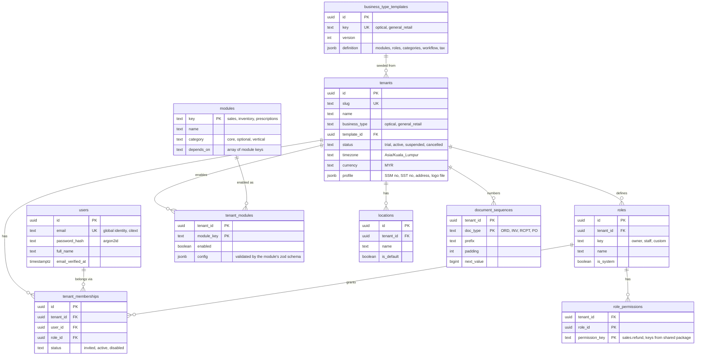
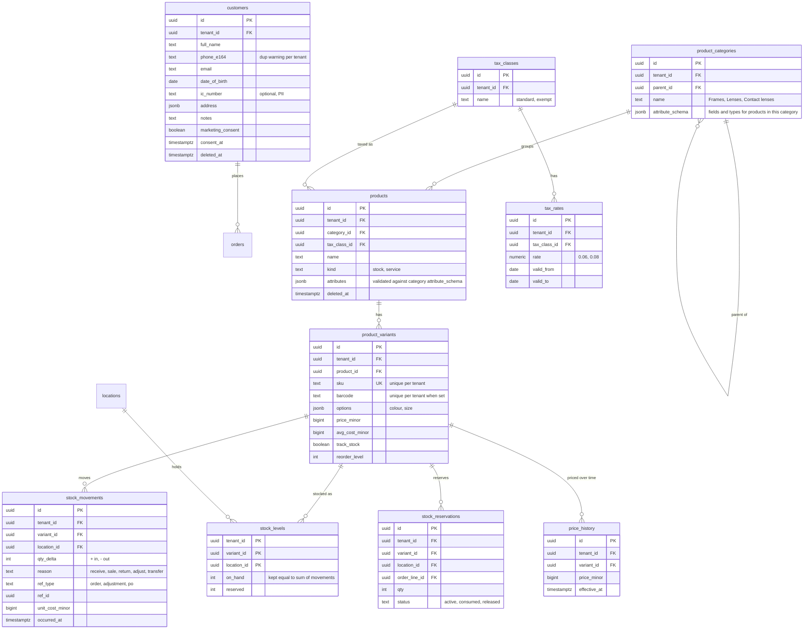
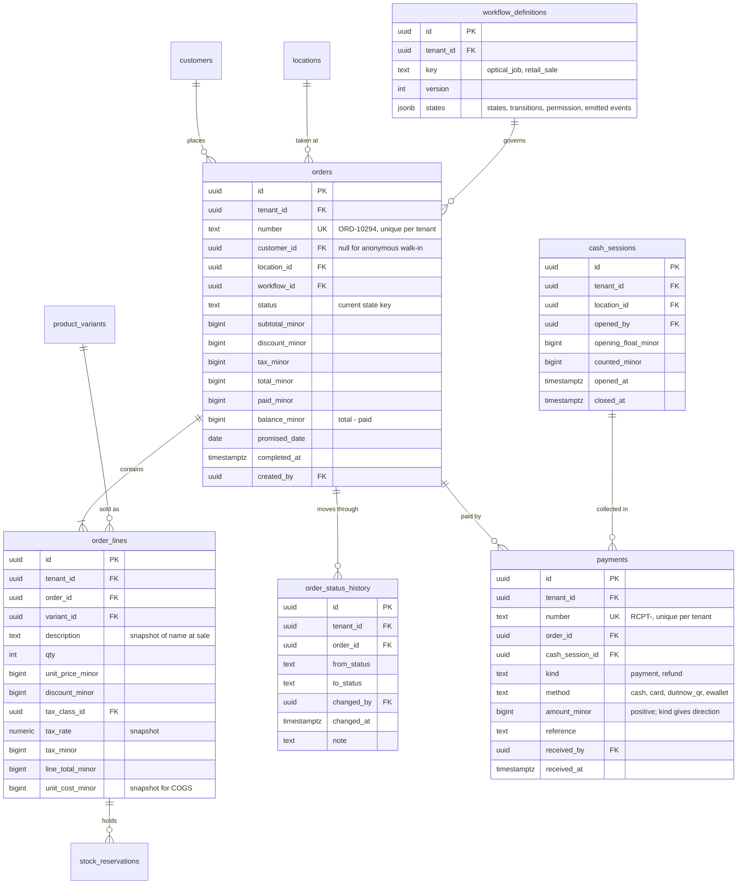
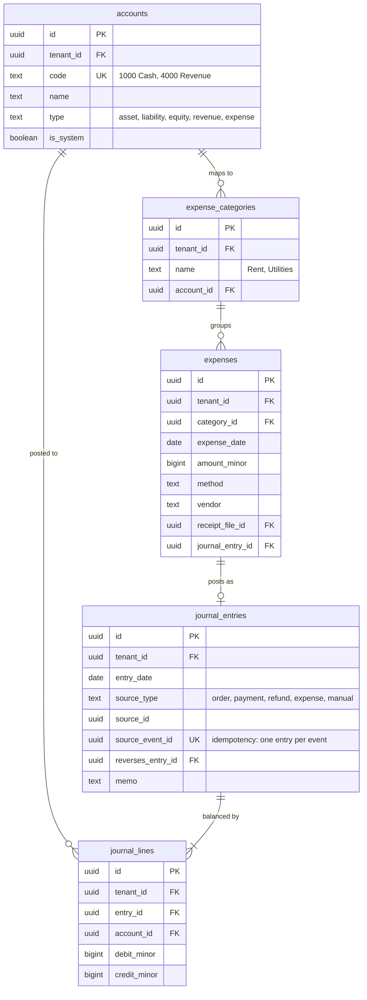
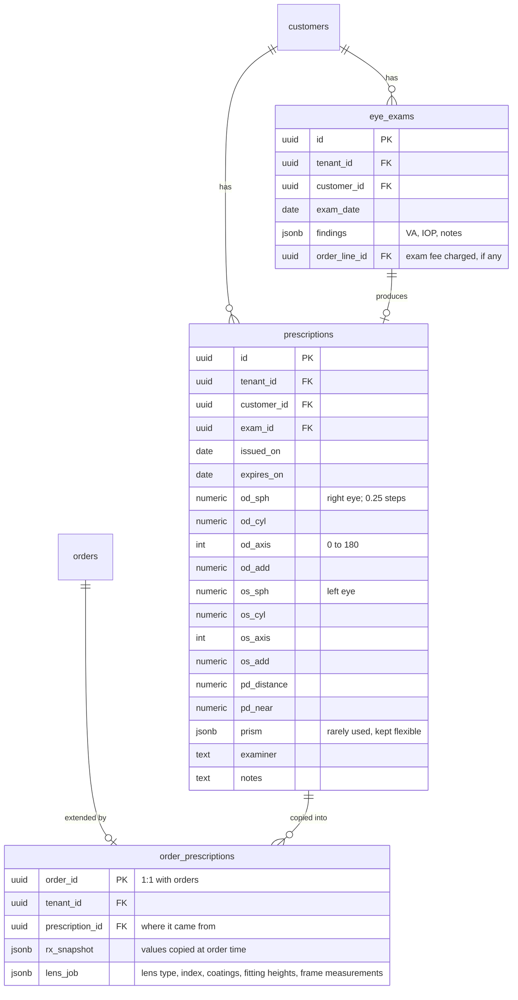

# BOS core data model (ERD)

Ticket: **BOS-167**. Status: **Draft, ready for review.**

This is the target schema for P1 (Foundations) and P2 (Optical MVP). The tables are created ticket by ticket in later migrations, so this doc is the map they follow. Naming, keys and other rules are in [database-conventions.md](database-conventions.md).

Diagrams are split by domain so they stay readable. A table drawn in one diagram may be referenced from another by its `*_id` column. Every tenant-scoped table also carries the base columns (`created_at`, `created_by`, `updated_at`, `updated_by`, and `deleted_at` where soft delete applies). The diagrams leave them out.

**Legend:**

- 🌐 Platform tables: no `tenant_id`, no RLS. Reached only by the platform admin app or by provisioning.
- 🔒 Tenant tables: `tenant_id` plus an RLS policy `tenant_id = current_tenant_id()`.

---

## 1. Platform, identity and tenancy

| Table                                                              | Scope | Notes                                                                                                                                                |
| ------------------------------------------------------------------ | ----- | ---------------------------------------------------------------------------------------------------------------------------------------------------- |
| `tenants`, `modules`, `business_type_templates`, `platform_admins` | 🌐    | `platform_admins` (not drawn) belongs to the admin app's separate auth (BOS-032)                                                                     |
| `users`                                                            | 🌐    | Global identity, so one email can belong to several tenants. Never exposed across tenants: tenant queries reach it only through `tenant_memberships` |
| everything else above                                              | 🔒    |                                                                                                                                                      |

## 2. Customers, catalog and inventory

`stock_movements` is **append-only**: no updates or deletes, and corrections are new movements. `stock_levels` is a maintained projection that a reconciliation test checks (BOS-042).

## 3. Sales, orders and payments (core)

- **Prices are copied onto order lines.** Price, tax rate, cost and description are copied at sale time, so later catalog edits never change past orders.
- **Order totals are always computed on the server.** `paid_minor` and `balance_minor` are updated in the same transaction as each payment.
- **Refunds are `payments` rows with `kind = refund`.** That keeps one cash trail. Returned items create `stock_movements` with `reason = return`.
- **No optical columns live here.** Sales stays vertical-free (see §5).

## 4. Accounting, expenses, platform plumbing

Not drawn, but part of the model:

| Table           | Scope | Purpose (ticket)                                                                                                                                                |
| --------------- | ----- | --------------------------------------------------------------------------------------------------------------------------------------------------------------- |
| `outbox_events` | 🔒    | `id`, `tenant_id`, `type`, `version`, `payload jsonb`, `occurred_at`, `processed_at`. Domain events are written in the same transaction as the change (BOS-024) |
| `audit_log`     | 🔒    | `actor_id`, `action`, `entity`, `entity_id`, `before`/`after jsonb`, `ip`, `at`. Append-only; the app role has no UPDATE or DELETE (BOS-025)                    |
| `files`         | 🔒    | `storage_key` (tenant-prefixed), `content_type`, `size`, `uploaded_by`. Used by receipts, logos and product images (BOS-027)                                    |
| `notifications` | 🔒    | `recipient_user_id` or `customer_id`, `channel`, `template`, `status`, `sent_at` (BOS-070)                                                                      |

- **Journal entries must balance.** A deferred constraint trigger checks that `sum(debit_minor) = sum(credit_minor)` per `entry_id`.
- **Journal entries are immutable.** A correction is a new entry with `reverses_entry_id` set (BOS-062).

## 5. Optical extension (vertical)

The optical vertical adds its own tables and points **into** core tables. Core tables never point back. This is the "vertical → core only" rule.

## 6. Walk-through: one optical order end to end

This is the scenario from the product brief: frame + lenses + anti-reflective coating, RM900 total, RM300 deposit.

| Step                                               | What happens                                                                                       | Tables written                                                                               |
| -------------------------------------------------- | -------------------------------------------------------------------------------------------------- | -------------------------------------------------------------------------------------------- |
| 1. Customer arrives                                | Found or created                                                                                   | `customers`                                                                                  |
| 2. Eye exam                                        | Exam recorded and an Rx produced                                                                   | `eye_exams`, `prescriptions`                                                                 |
| 3. Order created                                   | Number allocated; the tenant's `optical_job` workflow is attached                                  | `document_sequences`, `orders` (status `created`), `order_status_history`                    |
| 4. Items added                                     | Frame RM450, lens RM350, AR coating RM100, with prices and tax copied onto the lines               | `order_lines`                                                                                |
| 5. Rx attached                                     | Rx values copied plus lens job details                                                             | `order_prescriptions`                                                                        |
| 6. Deposit RM300                                   | Payment row; `paid_minor = 30000`, `balance_minor = 60000`; journal Dr Cash / Cr Customer deposits | `payments`, `orders`, `journal_entries`, `journal_lines`, `outbox_events` (PaymentReceived)  |
| 7. Frame reserved                                  | Reservation held against the frame variant                                                         | `stock_reservations`, `stock_levels.reserved`, `order_status_history`                        |
| 8. Lens ordered → received → assembly → QC → ready | Each status change is recorded; Ready emits an event                                               | `orders.status`, `order_status_history`, `outbox_events`                                     |
| 9. Customer notified                               | "Your glasses are ready"                                                                           | `notifications`                                                                              |
| 10. Pickup, balance RM600                          | Second payment; balance 0                                                                          | `payments`, `journal_*`                                                                      |
| 11. Completed                                      | `OrderCompleted` → reservation consumed, stock deducted, revenue/COGS/SST posted                   | `stock_reservations`, `stock_movements` (sale), `stock_levels`, `journal_*`, `outbox_events` |

Every hop has a table and a foreign key, and none of the core tables hold optical columns.

## 7. Open questions

These need a decision before or during the ticket named.

1. **Deposit accounting (BOS-062):** post deposits to a _Customer deposits_ liability and recognise revenue at completion (recommended, matches "sale happens at pickup"), or recognise revenue when the order is created?
2. **Primary key generation:** decided in BOS-010: `gen_random_uuid()` (v4, built in). UUIDv7 can still be adopted later without a schema change.
3. **Cross-tenant FK safety:** decided in BOS-010: composite foreign keys `(tenant_id, x_id) → (tenant_id, id)`. `createTenantTable()` adds the `unique (tenant_id, id)` they need to every tenant table.
4. **`users.email` case:** `citext` extension or lower-cased unique index? (The draft assumes `citext`.)
5. **Prescription storage:** typed columns per eye (drafted) vs. one `jsonb`. Typed columns validate better and are easier to report on. Revisit if contact-lens Rx needs very different fields.
6. **Multi-currency:** one currency per tenant for now (`tenants.currency`). Add a currency column to money tables only if a tenant ever needs mixed currencies.
